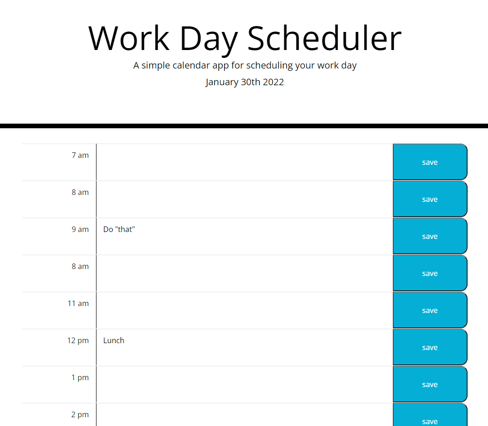

# Work Day Scheduler
An interactive tool to plan-out your day! 

## Purpose

* Used ```jQuery methods``` to manipulate the DOM.

* Used jQuery methods to attach delegated browser events to elements.

* Improved the user experience with ```focus and blur events```. 

* Leveraged ```Bootstrap's utility classes``` to avoid creating unnecessary custom CSS.

* Used ```Moment.js``` to handle JavaScript date and time functionality.

* Used JavaScript ```timer``` functions to schedule/automate logic.

* Used ```iconic``` icon library to implement font icons.

* Override default Bootstrap styles using ```custom CSS```.

## Built with 🛠️

* JavaScript
* HTML
* CSS

## Website

https://thisaramallawaarachchige.github.io/work-day-scheduler/



## Contribution

Made with ❤️ by Thisara MA